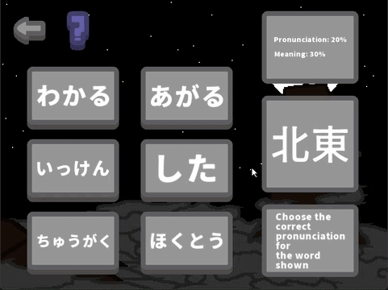
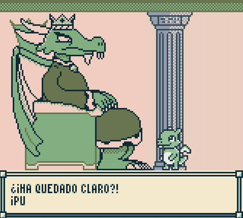
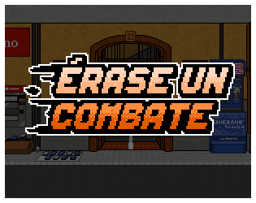

<!---->

<h1 align="center">
    ☀️<em>Te doy la bienvenida a mi cuenta de GitHub</em>☀️
</h1>

 

    

 

    Aquí encontrarás sobre todo jueguitos que hago en mi tiempo libre. Puedes hacer clic en las imágenes y en los gifs animados para acceder a las páginas de itch.io y a los repositorios de cada juego.

---

<h2 align="center">
    ALCHEMY TOGETHER
</h2>

    Tú y un amigo contra un coso azul volador, ¿¡quién ganará!?

    
    

---

<h2 align="center">
    MISSION 23
</h2>

    Sal al espacio exterior y enfréntate a alienígenas solo o en compañía.

    
    

---

<h2 align="center">
    KANJI GOD
</h2>

    Aprende japonés como un dios.

    
    

---

<h2 align="center">
    A PRINCESS BEYOND THE CLOUDS
</h2>

    Guía al príncipe de los dragones y ayúdale a liberar a su pueblo del hechizo del rey de los cielos. (El juego está sin terminar. Empecé a hacerlo para una Game Jam y no lo terminé jejej).

    
    </a>

---

<h2 align="center">
    ÉRASE UN COMBATE (En progreso)
</h2>

    Un tributo en forma de juego de peleas a la que probablemente sea la mejor serie de comedia española de todos los tiempos.

    
    

 
 

